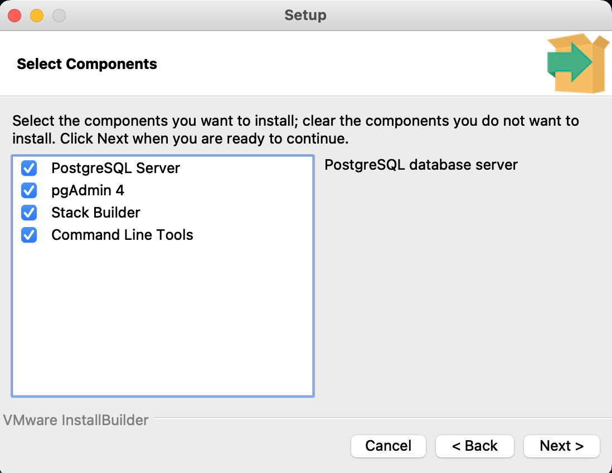
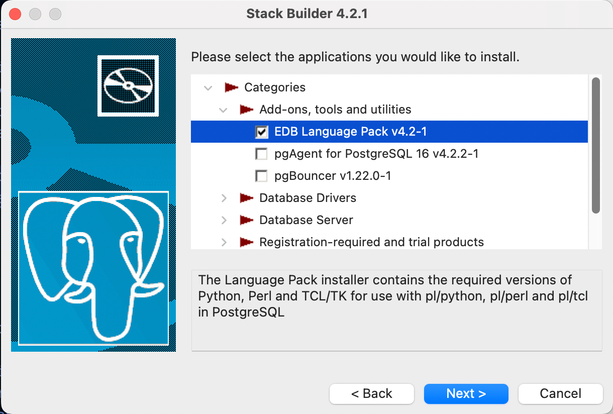

# Facial Recognition Using Postgresql &amp; PGvector

The objective of this experiment is to leverage the CLIP model in conjunction with PostgreSQL, employing the pgvector extension and PL/Python to execute transformation functions directly within the database for efficient searching. This setup involves a dataset of 202k low-resolution images. 

Instead of storing the images directly in the database, we store only their full file paths. The actual data stored in the database consists of image embeddings, which are generated by the CLIP model and encapsulated in 512-dimensional vectors as required by the model. This approach enables rapid search capabilities on a standard laptop.

We are showing also text to image search, searching on images content passing text as input. 

## Demo prep
### Install environment
* Install PostgreSQL. On Mac, make sure you install from the [graphical installer](https://www.enterprisedb.com/postgres-tutorials/installation-postgresql-mac-os) and you install Stack Builder as well.



```Installation Directory: /Library/PostgreSQL/16
Server Installation Directory: /Library/PostgreSQL/16
Data Directory: /Library/PostgreSQL/16/data
Database Port: 5432
Database Superuser: postgres
Operating System Account: postgres
Database Service: postgresql-16
Command Line Tools Installation Directory: /Library/PostgreSQL/16
pgAdmin4 Installation Directory: /Library/PostgreSQL/16/pgAdmin 4
Stack Builder Installation Directory: /Library/PostgreSQL/16
Installation Log: /tmp/install-postgresql.log
```

* Install EDB Language Pack according to (https://www.enterprisedb.com/docs/language_pack/latest/installing/macos/)



* Create a virtual environment using the python version that comes with the EDB Language Pack like this: 
```
virtualenv --python="/Library/edb/languagepack/v4/Python-3.11/bin/python" venv
source venv/bin/activate
```
```
home = /Library/edb/languagepack/v4/Python-3.11/bin
implementation = CPython
version_info = 3.11.7.final.0
virtualenv = 20.25.1
include-system-site-packages = false
base-prefix = /Library/edb/languagepack/v4/Python-3.11
base-exec-prefix = /Library/edb/languagepack/v4/Python-3.11
base-executable = /Library/edb/languagepack/v4/Python-3.11/bin/python3.11
```
* From the main directory, run `pip3 install -r requirements.txt`. This will install all Python dependencies.

*Dirtiest hack ever:* If you have issues with Postgres not finding your modules and you have no idea how to figure this out, just copy your python3.11(!) site-packages directly to `/Library/edb/languagepack/v4/Python-3.11/lib/python3.11/site-packages` and change the ownership to `root:daemon`. Then `select py_list_packages();` will show you all packages. As soon as i find a more "legal" way to do this i will update this README.

* Install pgvector 0.6 extension from https://github.com/pgvector/pgvector

* Validate that pl-python3u is working well.
  * Create a test function like:
```ps
CREATE OR REPLACE FUNCTION public.test_plpython(
	)
    RETURNS text
    LANGUAGE 'plpython3u'
    COST 100
    VOLATILE PARALLEL UNSAFE
AS $BODY$
    return "PL/Python is working!"
$BODY$;
```
  * then test using `select test_plpython();`
```
postgres=# select public.test_plpython();
     test_plpython     
 PL/Python is working!
(1 row)
```

* After test that plpython is working, from the `code` directory, run `python test_clip.py`

### Download images

* Download `img_align_celeba.zip` from [this Google Drive](https://drive.google.com/drive/folders/0B7EVK8r0v71pTUZsaXdaSnZBZzg?resourcekey=0-rJlzl934LzC-Xp28GeIBzQ) and decompress it in `dataset`.

* From the `dataset` directory, run `distribute_images.sh`. This will take (quite) a few minutes and will create 811 directories. Note: If you are going to host this demo on github, be smart and add the `image_group*` directories to your `.gitignore` 🤔. 


### Create Table, install Pl_python3u functions

Open psql and create the table using:
```
drop table if exists public.pictures;

CREATE TABLE IF NOT EXISTS public.pictures ( id serial, imagepath text, tag text, embeddings vector(512) ) TABLESPACE pg_default;
```

* Install the 3 functions inside DDL folder:
  * Run `generate_embeddings_clip_bytea.sql` to generate embedding from Bytea (Used by the streamlit application to get the input image and return an embedding to search inside the database)

  * Run `scan_specific_path_and_load.sql`. This is the main function to generate embedding in batch and load data inside pictures table. 

  * Run `process_images_and_store_embeddings_batch.sql` This create the functions to load folder of images, take an input pattern and call scan_specific_path_and_load for each folder in which we have images.

## Load Data

You can load images from a directory directly calling the pl-python function: process_images_and_store_embeddings_batch(source_dir text,tag text,batch integer)

if you have images for instance on: /Users/ton.machielsen/AI/FacialRecognition/dataset/image_group_811
```
select process_images_and_store_embeddings_batch(' /Users/ton.machielsen/AI/FacialRecognition/dataset/image_group_811', 'person', 32);

NOTICE:  Total processing time: 4.72 seconds
NOTICE:  Total image processing time: 2.40 seconds
NOTICE:  Total database insertion time: 0.03 seconds
NOTICE:  Total number of images processed: 99
process_images_and_store_embeddings_batch 
99
(1 row)
```

### Load All Data

You can load all data using the pl-python function from psql. we load in multiple phases as we did not create autonomous transactions.

```
SET work_mem = '512MB';
select public.scan_specific_path_and_load('/Users/ton.machielsen/AI/FacialRecognition/dataset/image_group_1*','person',32);
select public.scan_specific_path_and_load('/Users/ton.machielsen/AI/FacialRecognition/dataset/image_group_2*','person',32);
select public.scan_specific_path_and_load('/Users/ton.machielsen/AI/FacialRecognition/dataset/image_group_3*','person',32);
select public.scan_specific_path_and_load('/Users/ton.machielsen/AI/FacialRecognition/dataset/image_group_4*','person',32);
select public.scan_specific_path_and_load('/Users/ton.machielsen/AI/FacialRecognition/dataset/image_group_5*','person',32);
select public.scan_specific_path_and_load('/Users/ton.machielsen/AI/FacialRecognition/dataset/image_group_6*','person',32);
select public.scan_specific_path_and_load('/Users/ton.machielsen/AI/FacialRecognition/dataset/image_group_7*','person',32);
select public.scan_specific_path_and_load('/Users/ton.machielsen/AI/FacialRecognition/dataset/image_group_8*','person',32);
select public.scan_specific_path_and_load('/Users/ton.machielsen/AI/FacialRecognition/dataset/image_group_9*','person',32);
```

## Similarity Search using sample python program

Change the connection info inside search.py and run `python search.py '/Users/ton.machielsen/AI/FacialRecognition/images/profile.jpg'`
```
Fetching vector took 3.7596 seconds.
Querying similar images took 2.0207 seconds.
ID: 138770, ImagePath: /Users/ton.machielsen/AI/FacialRecognition/dataset/image_group_63/015617.jpg, Similarity: 0.5161815271858354
ID: 63340, ImagePath: /Users/ton.machielsen/AI/FacialRecognition/dataset/image_group_328/081983.jpg, Similarity: 0.4935592398533637
ID: 192757, ImagePath: /Users/ton.machielsen/AI/FacialRecognition/dataset/image_group_771/192593.jpg, Similarity: 0.4721324555013211
ID: 100762, ImagePath: /Users/ton.machielsen/AI/FacialRecognition/dataset/image_group_447/111506.jpg, Similarity: 0.4688953430182434
ID: 38097, ImagePath: /Users/ton.machielsen/AI/FacialRecognition/dataset/image_group_288/071797.jpg, Similarity: 0.4666365420882058
```

Now Create index on the table to speed up the search using `create index on pictures USING hnsw (embeddings vector_cosine_ops);` This will speed up the search from 0.8 sec to 0.08 sec. 

## Similarity Search using Streamlit application enabling WebCAM
Change the connection info on line 52 and beyond inside the file `Application/streamlit_face_reco.py` then run `streamlit run streamlit_face_reco.py`. Make sure an image called `logo.png` is in the directory in which the python program is running.

Currently on Mac we have the following issue:
```
If you can’t use your camera or video output device after updating to macOS Sonoma 14.1

'Starting in macOS Sonoma 14.1, cameras and video output devices that don’t use modern system extensions won’t be available to use unless you restore the legacy settings.

Starting in macOS Sonoma 14.1, only cameras and video output devices that use modern system extensions are supported on macOS. This modern software provides more secure and privacy conscious experience, including support for the camera privacy indicator — a green dot icon that displays in the menu bar while your camera is in use.

If your camera or video output device still uses older software, it won’t appear as an option to select and use in apps after you update to macOS Sonoma 14.1.

Apple has been working with video device makers to update their support software to the modern camera extension replacement, which became available in macOS Monterey 12.3. However, some video device makers haven’t yet updated — so their cameras or video output devices still rely on software that is no longer supported.’
```

## Similarity Search using Streamlit application eusing Text Search on Images. 

For this demo to work you need to add `generate_embeddings_clip_text.sql` to postgres.

Change the connection info on line 47 and beyond inside the file `Application/streamlit_face_reco.py` then run `streamlit run streamlit_face_reco_test.py`. Make sure an image called `logo.png` is in the directory in which the python program is running.```

